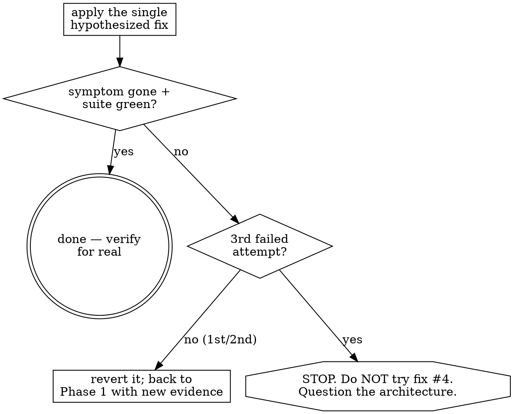

# Systematic Debugging

Find the root cause before you touch a fix. A fix aimed at a symptom you don't understand either misses, or papers over the real defect and spawns two more.

The failure mode this prevents: pattern-matching the error to a plausible-looking change, applying it, and — when it doesn't work — applying another, and another. Each blind attempt mutates the code, muddies the evidence, and moves you further from the cause. One understood fix beats five guesses.

## When to use

- Any bug, test failure, crash, hang, or "it works on my machine but not in CI."
- Output that's wrong in a way you can't immediately explain.
- Before proposing a fix — if you're about to say "try changing X," stop and confirm you know *why* X is the cause.

For a one-line obvious typo (wrong variable name the compiler points at), just fix it. This skill is for anything where the cause isn't already staring at you.

## The four phases — in order

You don't always need all four, but you may not skip *ahead* of a phase you haven't satisfied. You cannot hypothesize a cause (Phase 3) before you've reproduced and traced (Phase 1).

### Phase 1 — Find the root cause
- **Read the actual error.** The full message, the full stack trace, the exit code. Not the gist — the literal text. The answer is often in a line people skip.
- **A green you can't explain is a defect, not a pass.** AI/agent code fails silently — the loop exits 0 with a confidently-wrong answer and no error ever fires, so a passing-looking result you cannot account for is a bug *lead*, not a finish. Go simple-to-complex and never trust an output you can't explain; distrust the passing signal, don't just chase visible crashes. (Karpathy, *A Recipe for Training Neural Networks*: "neural nets fail silently… never trust a result you can't explain.")
- **Reproduce it consistently.** A bug you can't trigger on demand, you can't verify you fixed. Find the exact inputs/steps. If it's flaky, make it deterministic before going further (e.g. control the timing/seed/ordering that makes it intermittent). For a nondeterministic agent/LLM there is no single reproducible stack trace — a bug that fires 1-in-5 runs defeats both "reproduce on demand" and "write one failing test." Build a small graded example set (**compound-v:evals**) and treat *where it fails across runs* as your repro and your regression guard — the same role a failing test plays for deterministic code. (Hamel Husain, *Your AI Product Needs Evals* — "no eval system" is the #1 reason AI products fail.)
- **Shrink to the simplest failing case.** Strip the input down to the smallest instance that still fails — and check the system passes the *single simplest* instance (one item, empty list, one request) before you debug the broad case. If the simplest case already fails, the bug is upstream of everything you were looking at; debug *that* first.
- **Check what recently changed.** `git diff`, `git log` on the touched files. Most new bugs entered with recent edits. If the regression's onset is unclear, `git bisect` (ideally `git bisect run <failing-test>`) pins the exact commit that introduced it.
- **Trace backward from the symptom to its source.** Don't fix where the error *surfaces*; follow the data back to where it first goes wrong. In a multi-component flow, log (or inspect) the value at each boundary between components — the boundary where good input becomes bad output is your suspect. The error message location is a clue, not usually the cause.

### Phase 2 — Find a working reference
- If something *similar* works elsewhere in the codebase, compare against it **completely** — every difference, not the first one you spot. The bug is usually in a difference you dismissed as irrelevant.
- Make sure you understand the dependency/API you're using — read its real contract, don't assume its behavior.
- **Diagnose before mutating the environment.** When the failure looks like deps/build/env, do NOT reflexively install, uninstall, upgrade, or `rm -rf node_modules` first. Read the error, inspect the lockfile/config, understand *what's actually missing* — then act. Thrashing the environment destroys the evidence and often "fixes" it by accident, so you never learn the cause and it returns.

### Phase 3 — Form a single hypothesis
- State it explicitly: **"X is the root cause, because Y."** Writing it forces the causal claim into the open where you can check it.
- **One hypothesis, one variable at a time.** Changing three things at once and seeing it pass tells you nothing about which mattered — and one of the other two may now be a latent bug.
- If you genuinely don't know, say "I don't know" and go gather more evidence. A confident wrong hypothesis is worse than an admitted gap.
- **If you can't state what "correct" would even look like, the bug is underspecification, not a code defect.** Pin the expected behavior down first — otherwise you chase a symptom that keeps shifting as your notion of "right" drifts (Hamel Husain on *criteria drift*).

### Phase 4 — Fix and verify
- **Write a failing test that reproduces the bug first**, then fix until it passes (this is the bug-fix loop in **compound-v:test-driven-development**). The test is your proof the fix landed and your guard against regression.
- Make the **single** change your hypothesis predicts. Verify the symptom is gone and the suite stays green.
- If the fix doesn't work, that hypothesis was wrong. Revert it (don't leave failed attempts stacked in the code), return to Phase 1 with what you just learned, and count the attempt.

## The 3-attempt rule — stop digging, question the design

Track your fix attempts. The empirical cap before escalating is **three** — production agents converge on it independently: Devin gives up after 3 CI failures, Cursor stops after 3 lint-fix loops, WARP hard-codes `MAX_RETRIES=3`. This is the canonical home of the 3-attempt rule; **compound-v:recheck** and **compound-v:batched-implementation** cross-ref here for their fix↔recheck cap rather than restating it.

Classify the failure before you spend a retry. A **deterministic** red — validation error, missing/typed arg, auth revoked, type error — is guaranteed to fail again on the same inputs: **zero retries**, go straight to root cause or ask. Reserve the retry budget for genuinely **transient** faults (network blip, 503, rate limit). The retry-cap is for non-determinism, not for hoping a deterministic bug disappears — and a try/except-retry around a deterministic red is just that anti-pattern wearing a loop. (Standard transient-fault practice, e.g. Azure Architecture Center: retry only faults expected to be short-lived; never retry one guaranteed to recur.)

After three failed fixes, the problem is almost never the next tweak — your model of the system is wrong. **Do not attempt fix #4.** Stop and challenge a level-up assumption:

- Is my understanding of how this system works actually correct? (Re-read, re-trace — maybe the data doesn't flow the way I assumed.)
- Is the *design* the bug? A fix that keeps slipping away often means the abstraction is wrong, not the line.
- Am I fixing the right layer? The symptom may be downstream of a cause in a component I haven't looked at.
- Should I ask the user / surface the blocker? "I've tried A, B, C, each failed because Z — I think the issue is the design of W" is far more useful than a fourth guess.

A signal you've already crossed this line: you're adding defensive checks, retries, or `try/except` around a symptom you can't explain. That's not a fix — it's hiding the bug. Go back to root cause.

## Red flags

| Thought / behavior | What to do instead |
| --- | --- |
| "Let me just try changing this and see." | You're guessing. Reproduce and trace to the cause first (Phase 1). |
| "I'll reinstall deps / bump the version and hope." | Diagnose before mutating the environment — read the error and the lockfile first (Phase 2). |
| "It might be one of these few things, I'll fix all of them." | One hypothesis, one variable. Fixing several at once hides which was real and may add bugs. |
| Wrapping the symptom in a try/except or a retry to make it pass | That's concealment, not a fix. Find why it throws. |
| "The error message is long, I'll skim it." | Read it fully — the exact cause is often in the part you'd skip. |
