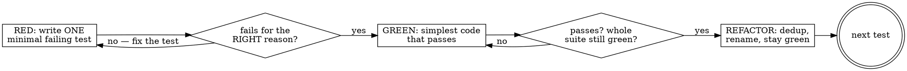

# Test-Driven Development

Write the test first. The failing test is the spec; the implementation exists only to turn it green.

For an agent, TDD is no longer the slow tax it was for humans. The test is "five tokens" of instruction and the model spins on it without complaining (Willison, "Engineering practices that make coding agents work"). Its real payoff is two things you can't get from tests-after:

- **It bounds the work.** A failing test defines *exactly* what "done" means, so the model writes the minimum to pass and stops — instead of gold-plating or drifting. ("TDD stops the agent writing more than it needs.")
- **It is the verifiable signal.** A green suite you watched go red-then-green is the evidence that lets you trust code without reading every line. This is the leash that makes an autonomous agent safe to run.

The cost of tests used to be the writing and the maintenance. For an agent that's near zero now, so tests are no longer optional — skipping them is leaving the one cheap proof of correctness on the table.

## When to use

- Implementing any feature or bugfix where correctness matters past today.
- A bug report: the reproduction *is* the test (see the bug-fix loop below).
- Any time you're about to claim something works — if there's no test, there's no claim.

Skip it for genuinely throwaway code (a one-off script, a scratch HTML page) where "it either works or it doesn't" and nobody maintains it. Quality is a choice you make per context, not a ritual.

Tune testing intensity to how hard bugs are to spot: test database and business-logic layers rigorously (corruption hides for weeks), test the visible frontend lightly (bugs show up in the browser) — intensity scales inversely with how easily a bug is observed (Andrew Ng, DeepLearning.AI).

## The loop: red → green → refactor



**RED — one minimal test.** Name it for the behavior (`rejects_expired_token`, not `test1`). Test against **real code, not mocks** — see the anti-patterns below. The model writes the assertion for free; choosing *what* it should assert is the judgment that's now yours — a flawlessly-written test against the wrong spec is a worthless suite (Andrew Ng, DeepLearning.AI).

**Verify RED — and read *why* it failed.** A test that fails because of an import error or a typo proved nothing. It must fail because the behavior is genuinely missing. If it passes immediately, the test is wrong (or the behavior already exists) — fix that before writing any implementation.

**GREEN — the simplest thing that passes.** Resist building for requirements no test demands yet. Each later test pulls the design forward.

```python
# Good — simplest code that turns the test green:
def total(items):
    return sum(i.price for i in items)

# Bad — over-built for a test that only checks a sum;
# no test asked for currencies, rounding, or discounts:
def total(items, currency="USD", rounding="bankers", discount=None):
    ...  # YAGNI — delete it until a test needs it
```

**Verify GREEN.** Start with the narrowest test for the code you changed (fastest signal), then widen to the whole suite — confirm you didn't break something else (OpenAI Codex CLI, "Testing Philosophy").

**REFACTOR.** Now clean up (extract, rename, dedupe) with the green suite as your safety net. Behavior unchanged, tests stay green.

## Real code, not mocks

The point of a test is to exercise the actual behavior. Mocks that assert on themselves prove nothing.

- **Don't test the mock.** `mock.assert_called_with(...)` checks that you called your own stub — it tells you nothing about whether the code works. Test the real output, the real state change, the real return value.
- **Don't mock what you don't understand.** If you mock a dependency without knowing its real contract, the mock encodes your *assumption*, and the test passes against a fiction.
- **No test-only methods in production classes.** If a class needs a `reset_for_test()` hatch to be testable, the design is wrong — fix the seam, don't add the hatch.
- **Prefer real collaborators** (a real in-memory DB, a real temp file, a real local server) over mocks wherever it's cheap. It's cheaper than ever to spin one up — ask the model to seed realistic fixtures ("create 100 users with made-up names").

A passing test suite still doesn't prove the system *runs* — tests miss "the web server won't even start." After green, exercise it for real: **compound-v:verification-before-completion**.

## The bug-fix loop

A bug means a behavior you believe is covered isn't. So:

1. Write a test that **reproduces** the bug — it should fail, demonstrating the bug exists.
2. Confirm it fails for the right reason (it hits the actual defect, not a setup error).
3. Fix the code until that test passes — and the rest of the suite stays green.

Writing the reproduction first is also how you *understand* the bug. If you can't write a failing test for it, you don't yet understand it — which is a debugging problem: use **compound-v:systematic-debugging**.

## Red flags

| Thought | Why it's wrong |
| --- | --- |
| "I'll add tests after it works." | Tests-after pass on the first run and prove nothing — they ratify whatever you wrote, bugs included. You also lose the scope-bounding that writing the test first gives you. |
| "The test passed immediately, good." | A test that never failed is unverified — it might assert nothing, or the behavior already existed. Make it go red first. |
| "I'll mock the database to keep it fast." | A mock encodes your assumption of the dependency; use a real (in-memory/temp) collaborator so the test exercises the real contract. |
| "Tests are green, so I'm done." | Green is necessary, not sufficient — the suite can pass while the app won't boot. Verify for real before claiming done: **compound-v:verification-before-completion**. |
| "I wrote the code first, I'll just keep it." | Then you can't know the test actually tests it. Delete or set it aside, write the test, watch it fail, restore. |
| Waiting for async work with a fixed delay (`setTimeout`, `sleep(500)`) | Flaky by construction — too short is a false red, too long crawls the suite. Wait on the *condition* (poll until the state holds, with a timeout cap), never a bare clock delay. |
